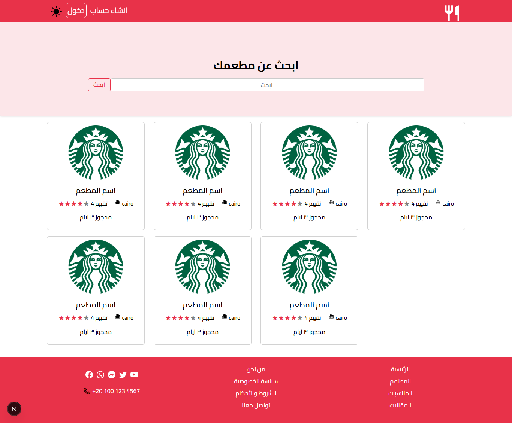
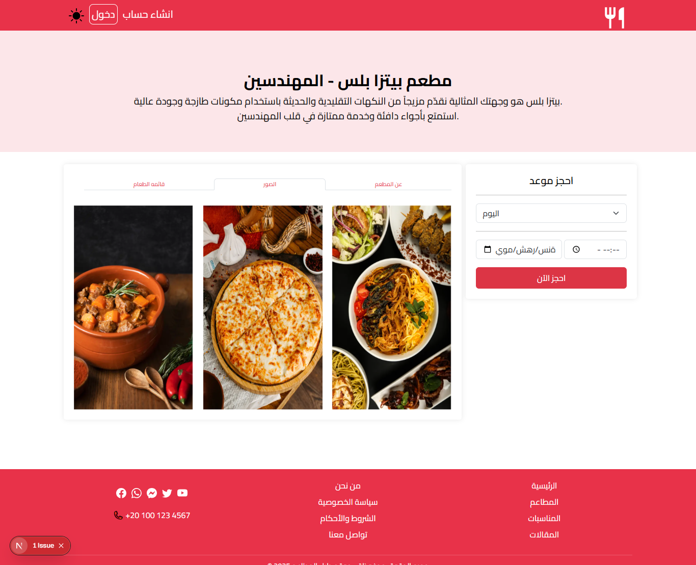
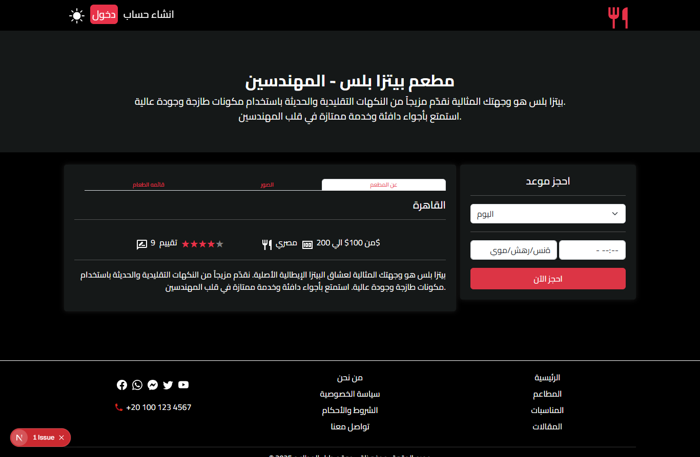

# Restaurant Booking UI - Next.js + Bootstrap

A modern and responsive restaurant listing and booking interface built using **Next.js** and **Bootstrap**. This project focuses on **UI design only**, with pages to display restaurants, view detailed information, and simulate a booking form.

## ✨ Features

- Homepage displaying a list of restaurants
- Individual restaurant detail pages
- Booking form (UI only)
- Responsive design using Bootstrap 5
- Smooth page routing with Next.js
- Clean and organized code structure

## 📸 Screenshots

### 🏠 Homepage

### 📄 Restaurant Details Page

### 📅 Booking Form

## 🛠️ Technologies Used

- [Next.js](https://nextjs.org/)
- [React](https://reactjs.org/)
- [Bootstrap 5](https://getbootstrap.com/)
- CSS Modules or Global CSS
